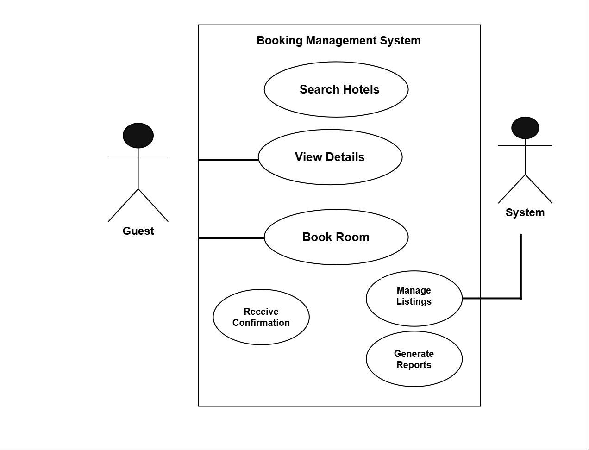

# 🧾 Requirement Analysis in Software Development

## Introduction
This repository is dedicated to exploring the **Requirement Analysis** phase in software development — a crucial step that defines the foundation of any successful project.

It covers the process of **gathering, documenting, and managing software requirements** to ensure that the final product aligns with user needs and business goals.

You’ll find examples, templates, and explanations of best practices for effective requirement analysis, including how to:
- Communicate effectively with stakeholders  
- Define functional and non-functional requirements  
- Maintain traceability throughout the project lifecycle  

---

## 📘 What is Requirement Analysis?
**Requirement Analysis** is the process of identifying, understanding, and documenting the needs and expectations of stakeholders for a software system.  

It serves as the foundation for software design and development by ensuring all functionalities and constraints are clearly defined before coding begins.  

In the **Software Development Life Cycle (SDLC)**, requirement analysis ensures:
- The project’s goals are aligned with business objectives.  
- Developers and stakeholders have a shared understanding of deliverables.  
- Potential issues are discovered early, reducing costly rework later.

---

## 💡 Why is Requirement Analysis Important?
Requirement Analysis is one of the most critical stages in the SDLC because it shapes the direction of the entire project.  

Here are **three key reasons** why it is important:

1. **Prevents Miscommunication**  
   It ensures all stakeholders — clients, developers, and designers — have a common understanding of what the software should achieve.

2. **Improves Project Planning**  
   Well-defined requirements help in accurate estimation of time, cost, and resources needed to complete the project.

3. **Reduces Rework and Errors**  
   By clarifying expectations early, the risk of building incorrect or incomplete features is minimized, saving both time and effort.

---

## ⚙️ Key Activities in Requirement Analysis
The requirement analysis process typically involves five major activities:

- **Requirement Gathering:**  
  Collecting information from stakeholders through interviews, surveys, meetings, and document reviews.

- **Requirement Elicitation:**  
  Actively engaging stakeholders to understand their needs, motivations, and goals for the system.

- **Requirement Documentation:**  
  Recording gathered requirements in a structured and standardized format, such as Software Requirement Specification (SRS) documents.

- **Requirement Analysis and Modeling:**  
  Examining and modeling requirements using tools like flowcharts, use case diagrams, or data models to understand system behavior.

- **Requirement Validation:**  
  Ensuring that documented requirements are clear, complete, feasible, and align with stakeholder expectations.

---

## 🧩 Types of Requirements

### **1. Functional Requirements**
These define **what the system should do** — the specific behaviors, functions, or features it must perform.

**Example (Booking Management System):**
- Users should be able to **search for hotels** based on location, price, and availability.  
- Users can **book a room** and receive a confirmation via email.  
- Admins can **add, edit, or remove listings** from the system.  
- The system should **generate booking reports** for admins.

### **2. Non-functional Requirements**
These define **how the system performs** — covering quality attributes like performance, security, and usability.

**Example (Booking Management System):**
- The system should handle **up to 10,000 concurrent users** without performance degradation.  
- The application must **load within 3 seconds** under normal conditions.  
- All user data should be **encrypted using HTTPS and AES-256** encryption.  
- The platform should maintain **99.9% uptime** annually.

---

## 🎯 Use Case Diagrams
**Use Case Diagrams** visually represent how different users (actors) interact with the system to achieve specific goals.  

They help in identifying:
- The main functionalities (use cases) of the system.  
- The roles or actors interacting with those functionalities.  
- The boundaries of the system being analyzed.

**Benefits of Use Case Diagrams:**
- Simplifies communication with non-technical stakeholders.  
- Clarifies the system’s scope.  
- Helps identify missing or overlapping functionality early in the design process.

### 🧱 Use Case Diagram for Booking Management System
Actors:
- **Guest/User**
- **Admin**
- **System (Payment Gateway, Notification Service)**

Use Cases:
- Search Hotels  
- View Details  
- Book Room  
- Make Payment  
- Receive Confirmation  
- Manage Listings (Admin)  
- Generate Reports (Admin)

**Use Case Diagram:**  

*(Diagram created using Draw.io and exported as `alx-booking-uc.png`)*

---

## ✅ Acceptance Criteria
**Acceptance Criteria** are the conditions that must be met for a feature to be considered complete and acceptable to stakeholders.  
They serve as a bridge between requirements and testing by defining *how success is measured* for each functionality.

### **Importance of Acceptance Criteria**
- Ensures all stakeholders have a shared understanding of what “done” means.  
- Helps QA teams design relevant test cases.  
- Prevents scope creep by clearly defining feature boundaries.

### **Example: Checkout Feature (Booking Management System)**

**Feature:** Checkout Process  

**Acceptance Criteria:**
1. The user must be able to review their booking details before confirming.  
2. The system must securely process payments via the integrated payment gateway.  
3. A confirmation email with booking details must be sent after successful payment.  
4. In case of payment failure, the user should receive an error message and be prompted to retry.  
5. The system must log all transaction details for record-keeping.

---

## 👩‍💻 Author
Created by **Benjamin Nyankson**  
🌐 GitHub: [https://github.com/benjamin-nyankson](https://github.com/your-username)

---
